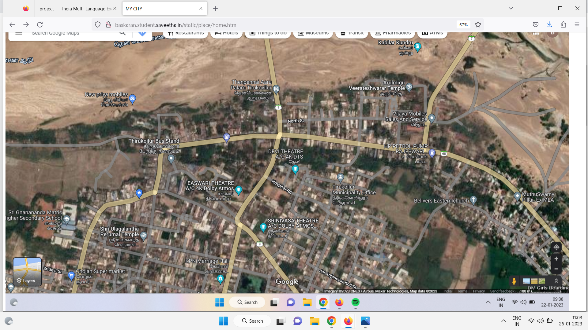

# Places Around Me
## AIM:
To develop a website to display details about the places around my house.

## Design Steps:

### Step 1:
clone from github.
###  Step:
create new djano project
### Step 3:
write my html step.
## Code:
Include your HTML code here
```
home.html
<!DOCTYPE html>
    <html lang="en">
        <head>
            <title>MY CITY</title>
            <meta charset='utf-8'>
            <meta http-equiv='X-UA-Compatible' content='IE=edge'>
            <meta name='viewport' content='width=device-width, initial-scale=1'>  
        </head>
        <body>
            <!-- Image Map Generated by http://www.image-map.net/ -->


<map name="image-map">
    <area target="_self" alt="" title="" href="ulagala.html" coords="404,852,112" shape="circle">
    <area target="_self" alt="" title="" href="kabilar.html" coords="1410,198,86" shape="circle">
    <area target="_self" alt="" title="" href="Veerateshwarar.html" coords="1314,398,128" shape="circle">
    <area target="_self" alt="" title="" href="school.html" coords="163,762,111" shape="circle">
    <area target="_self" alt="" title="" href="bustand.html" coords="536,525,117" shape="circle">
</map>
        </body>
        </html>
        
bustand.html
<html>
    <head>
        <title>bustand</title>
    </head>
    <body>
<h1>     1.Required cleaning platform and general area,</h1>  
 <h1>    2.Seating facility will not providing at Plot form.</h1>  
 <h1>    3.Why not try to free urinate place for both genter it was the main  request to all over Tamil Nadu and Nation.</h1>  
 <h1>
     all bus are availalable in this region
 </h1>
    </body>
</html>

kabiler.html
<html>
    <head>
        <title></title>
    </head>
    <body>
        <h1> Kabilar Kundru (or Kabilar rock) is a hill rock in the middle of the Ponnaiyar River near Tirukoilur in Viluppuram district, Tamil Nadu, India.[1][2] It is known for Tamil poet Kapilar did Vadakirrutal (fast unto death) here, after his friend Vēl Pāri was killed in a battle.[3] It is one of the protected monuments in Tamil Nadu by the Archaeological Survey of India.[4]</h1>
        <h1> "Viluppuram District Tourist Places — Thirukkoilur". Viluppuram District — National Informatics Centre. Archived from the original on 25 February 2017. Retrieved 26 February 2014.</h1>
        <h1>"Tirukkoilur". Tamil Nadu Archaeology Department. Retrieved 26 February 2014.</h1>
        <h1>"Sri Veeratteswarar temple — Greatness Of Temple". Dinamalar. Retrieved 26 February 2014.</h1>
        <h1>"Protected Monuments in Tamil Nadu". Archaeological Survey of India. Retrieved 26 February 2014. S. No. 82. Kabilar Rocks</h1>
    </body>
</html>

verrateswara.html
<html>
    <head>
        <title></title>
    </head>
    <body>
        <h1>It's one of the Ashta Veeratanam temples, Lord Shiva slayed Andakasura in here. History dates back to 3 Century BC and this temple is mentioned in many Tamil Literatures. Maasi Magam festival in this temple is auspicious.

Amenities are available for bathing, etc with a nominal charge. Ample parking space available. Temple is in little bit bad state, urgent action required.

Perumal Temple & Kabilar Kundru are must visit near this Great Temple.
</h1>
<h1>Located in the Banks of Thenpennai River, This Shiva Temple is Magnificent. The idols placed inside the temple are so lovely and have life in it. Each Idol has a long history behind it. Feel free to speak to the priests over there who would be happy to share with you. Second Temple in the series of Atta Veeratta Sthalam which has a historical connect.</h1>
    </body>
    </html>
    
 ulagalantha.html
  <head>
        <title>Shri Ulagalantha Perumal Temple</title>
    </head>
    <body>
        <h1>The temple priests perform the puja (rituals) during festivals and on a daily basis. As at other Vishnu temples of Tamil Nadu, the priests belong to the Vaishnava community, from the Brahmin varna. The temple rituals are performed six times a day: Ushathkalam at 7 a.m., Kalasanthi at 8:00 a.m., Uchikalam at 12:00 p.m., Sayarakshai at 6:00 p.m., Irandamkalam at 7:00 p.m. and Ardha Jamam at 10:00 p.m. Each ritual has three steps: alangaram (decoration), neivethanam (food offering) and deepa aradanai (waving of lamps) for both Ulagalantha Perumal and Poongothai. During the last step of worship, nagaswaram (pipe instrument) and tavil (percussion instrument) are played, religious instructions in the Vedas (sacred text) are recited by priests, and worshippers prostrate themselves in front of the temple mast. There are weekly, monthly and fortnightly rituals performed in the temple.[4]

Various festivals are celebrated in the temple, with the 15-day Panguni Brahmmotsavam in March–April with Sri Pushpavalli Thayar Oonjal, being the most prominent one. During the Masi Magam festival celebrated in February–March, the festive deity is carried on the shoulders of devotees to Cuddalore. Other festivals are Purattasi Pavithra Utsavavm, Navaratri, Srirama Navami, Sri Ramanuja Jayanthi, Vasanth Utsavam in April–May, Vaikasi Visaka Garuda Seva, NammAlvar Sattrumurai in May–June, Aani PeriAlvar Sattrumurai in June–July, Aadi Thiruvadipooram, Andal Utsavam in July–August, Avani Sri Jayanthi, Uriyadi utsavam in August–September, Aipasi Mudalazwar Sattrumurai, Sri Manavala Mamunigal utsav in October–November, Karthikai Kaisika Ekadasi, Tirukarthikai in November–December, Margali Rapathu, Pagal Pathu and Vaikunta Ekadashi in December–January.[4]

Religious significance
The temple is revered in the Naalayira Divya Prabandham, the 7th–9th century Vaishnava canon, by Tirumalisai Alvar in one hymn. The temple is classified as a Divya Desam, one of the 108 Vishnu temples that are mentioned in the book.[4] The temple is counted among the three Divya Desams that has Ulagalantha Perumal as the presiding deity, with the other two being Kanchipuram Ulagalantha Perumal temple and Kazheesirama Vinnagaram at Sirkali.[13]
</h1>
<h1>history</h1>
<h1>
    It was originally under the rule of Malayaman Malayarayan chieftains [9] and later switched hands to Miladudaiyar and again went back to Malayaman Malayarayan chieftains. Both Miladudaiyars and Malayaman Malayarayan chieftains had direct relationship with the Medieval Cholas, with their princess Sembian Mahadevi daughter of Malavarayar marrying Gandaraditya and Vanavan Mahadevi marrying Sundara Chola and gave birth to Rajaraja I, the illustrious Chola king.[10] There are multiple inscriptions in the temple from Chola, Pandya, and Vijayanagara Empire indicating donations to the temple. An inscription from Rajendra Chola II indicates that the temple was called Thiruvidaikali Alvar temple. A chieftain by name Ranakesari Raman reconstructed the whole sanctum with granite as the old structure built of bricks developed cracks. He also built five pinnacles, the veranda and the hall in front of it. Another inscription during the regime of Rajadhiraja Chola in 1171 CE indicates the donation of seven kalanju (a measure used in olden times) by a lady for the conduct of festivals of Vaikasi and Aippasi and also for the recitation of Tiruvaymoli sung by Nammmalvar in the temple.[11]

The temple was originally made of bricks, but during the period of Virarajendra Chola (1063–70), a granite structure was developed. Narasimha Varma constructed the other shrines also in granite. The temple received benevolent contributions from most of the later Chola rulers like Rajadhiraja Chola (1018–1054), Rajendra Chola II (1051–1063) and other rulers of the region like Vikramapandiya, Koperujinga and Vijayanagara rulers like Saluva Narasimha Deva Raya (1485–1491) and Sadasiva Raya (1542–1570) as seen from the inscriptions in the temple. The temple was expanded during the rule of the Vijayanagar kings and Nayaks. The temple was the fortress to the British during the Carnatic wars. It was also attacked during the days of the period of Hyder Ali.[12]
</h1>
        </body>
 
school.html
<html>
    <head>
        <title>SRI GNANANANDA MATRICULATION HIGHER SECONDARY SCHOOL</title>
    </head>
    <body>
        <h1>SRI GNANANANDA MATRICULATION HIGHER SECONDARY SCHOOL</h1>
        <h1> since 1983 very famous school arrount seroundind area</h1>
        <h1>This school is famous in thirukovilur. All the students spoke in english with everyone. Good quality teachers are available. Swiming pool training is given to the students.</h1>
        <h1>good for sports</h1>
    </body>
    </html>
    
```        

## Output:
Include your output screenshot here



## Result:
Write your result
